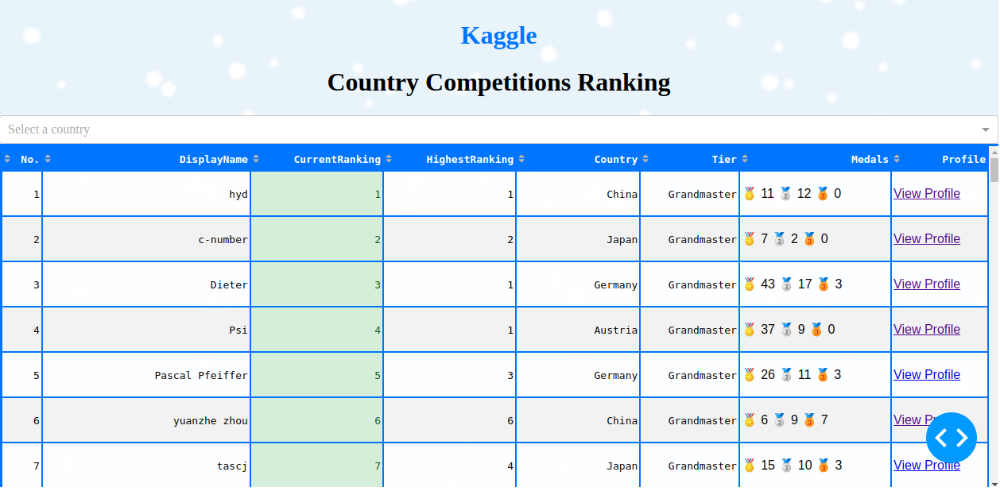
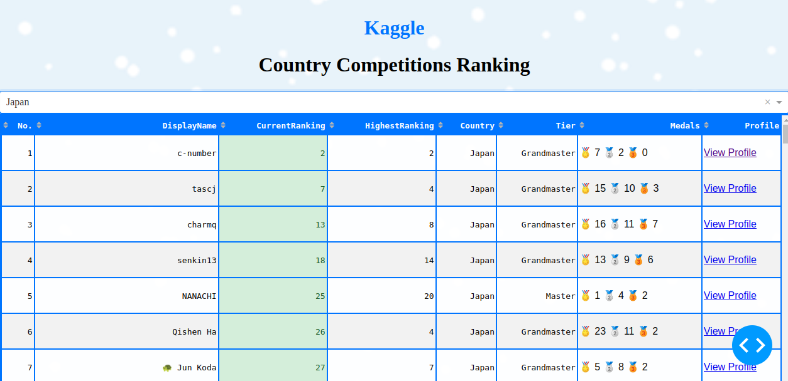

# Kaggle Country Competitions Ranking Dashboard

This project is a web application built using Dash that visualizes the rankings of countries in various Kaggle competitions. \
The application allows users to select a country from a dropdown menu and displays relevant achievements and rankings in a dynamic table format.

{width=40% height=40%}
{width=40% height=40%}

## Local

```bash
git clone git@gitlab.com:AdrianWisniewski/kaggle-country-competitions-ranking-dashboard.git
cd kaggle-country-competitions-ranking-dashboard
conda env create --file=environment.yml
conda activate dashboard
python scripts/dashboard.py
# Dash is running on http://0.0.0.0:8050/
```

## Docker

```bash
git clone git@gitlab.com:AdrianWisniewski/kaggle-country-competitions-ranking-dashboard.git
cd kaggle-country-competitions-ranking-dashboard
docker build -t dashboard .
docker run -p 8050:8050 dashboard
# Dash is running on http://0.0.0.0:8050/
```
